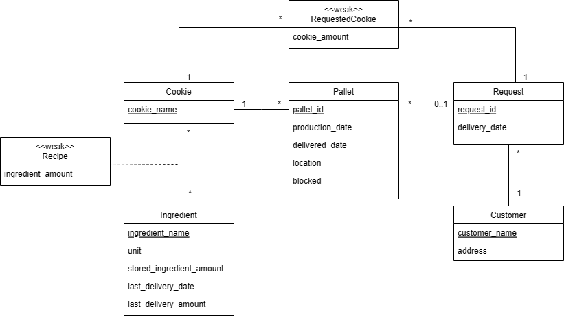

# EDAF75, project report

This is the report for

 + Filip Lennhager, `fi4154le-s`
 + Jonathan Do, `jo2758do-s`
 + Felix Rödén, `fe2220ro-s`

We solved this project on our own, except for:

 + The Peer-review meeting


## ER-design

The model is in the file [`er-model.png`](er-model.png):

<center>
    
</center>


## Tables

The ER-model above gives the following tables (including keys and
foreign keys):

```text
table customers:
  customer_name      
  address    
  PK: customer_name

table cookies:
  cookie_name
  PK: cookie_name

table recipes:
  cookie_name
  ingredient_name
  ingredient_amount
  FK: cookie_name -> cookies(cookie_name)
  FK: ingredient_name -> ingredients(ingredient_name)

table ingredients:
  ingredient_name
  unit
  stored_ingredient_amount
  last_delivery_date
  last_delivery_amount
  PK: ingredient_name

table pallets:
  pallet_id
  cookie_name
  production_date
  delivered_date
  location
  blocked
  PK: pallet_id
  FK: cookie_name -> cookies(cookie_name)

table requests:
  request_id
  delivery_date
  PK: request_id

table requestedCookies
  cookie_amount
  request_id
  cookie_name
  FK: request_id ->  requests(request_id)
  FK: cookie_name -> cookies(cookie_name)
```


## Scripts to set up database

The scripts used to set up and populate the database are in:

 + [`create-schema.sql`](create-schema.sql) (defines the tables), and
 + [`initial-data.sql`](initial-data.sql) (inserts data).

So, to create and initialize the database, we run:

```shell
sqlite3 krusty-db.sqlite < create-schema.sql
sqlite3 krusty-db.sqlite < initial-data.sql
```

## How to compile and run the program

This section should give a few simple commands to type to
compile and run the program from the command line, such as:

```shell
python app.py
```
After running the program, test the program with:

```shell
python test.py
```
